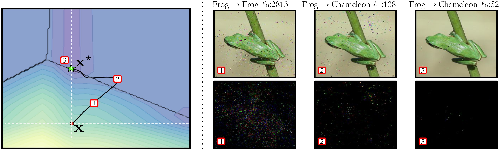

# σ-zero: Gradient-based Optimization of ℓ0-norm Adversarial Examples

This code is the official PyTorch implementation of the **σ-zero: Gradient-based Optimization of ℓ0-norm Adversarial Examples**.



The leftmost plot shows an instance of σ-zero’s execution on a two-dimensional problem. The initial point x (red dot) is modified via gradient descent to find the adversarial example x* (green star) while minimizing the number of perturbed features (i.e., the ℓ0 norm of the perturbation). The gray lines surrounding x demarcate regions where the ℓ0 norm is minimized. The rightmost plot shows the adversarial images (top row) and the corresponding perturbations (bottom row) found by σ-zero during the three steps highlighted in the leftmost plot, alongside their prediction and ℓ0 norm.
## Dependencies and Reproducibility

- Python ≥ 3.11.*
- PyTorch ≥ 2.0.*
- torchvision ≥ 0.15.*
- RobustBench ≥ 1.1
- adversarial-library ≥ 0.2.0
- torchattacks ≥ 3.5.1

In order to improve the reproducibility of our experiments, we released our anaconda environment, containing all dependencies and corresponding SW versions. 
The environment can be installed by running the following command: 

```shell
conda env create -f env.yml
```
Once the environment is created, we can use it by typing `conda activate sigmazero`.

## Code Folding

The code is structured as follows: 

- **configs/**, where experimental configurations are stored.
- **data/**, where datasets are downloaded and stored.
- **imagenet/val/**, where the validation set of imagenet needs to be stored.
- **models/**, where models are downloaded and stored.
- **results/**, contains the results of the experiments created by the main script.
- **utils/**, contains wrappers for model and attacks.
- **datasets.py**, used to load datasets.
- **model.py**, used to download models to test.
- **sigma_zero.py**, contains the official implementation of σ-zero attack.
- **utilities.py**, contains useful function to run experiments.
- **main.py**, executes experiment in `{args.config}` on device `{args.device}`.


### Running Experiments 
To execute an experiment where a number of attacks generate adversarial examples for a selected model, firstly a configuration must be created:
```json
{
    "seed": 1233,
    "experiments": [
        {
            "attack": {
                "name": "sigma_zero",
                "params": {
                    "steps":100
                }
            },
            "dataset": "mnist",
            "model": "smallcnn_ddn",
            "n_samples": 100,
            "batch_size": 16
        }
    ]
}
```
Experiments is an array that can contain different attack configurations like the one above.
Experiment are then run by calling the main function:
```shell
python main.py --device=cpu --config=configs/config_single_attack.json
```
After having executed the main function, a folder structure inside **results/**" will be created containing
results, salient statistics and some resulting adversarial images.

## Acknowledgements

The authors would like to thank:

  + The contributors of [adversarial-library](https://github.com/jeromerony/adversarial-library), [RobustBench](https://github.com/RobustBench/robustbench) and [Torchattacks](https://github.com/Harry24k/adversarial-attacks-pytorch) for having facilitated the development of this project;

